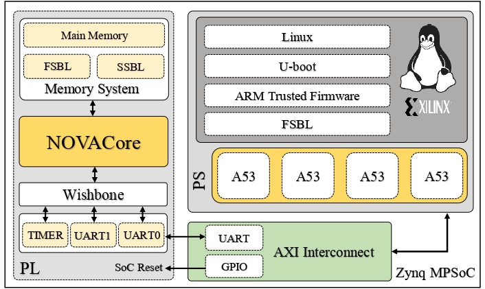

**NOVACore** is a high-performance, seven-stage, in-order RISC-V processor designed for embedded and compute-intensive applications. Originally developed in VHDL for FPGA deployment and later implemented in silicon. The processor supports the RV32IZmmul-Zicsr instruction set, including base integer arithmetic (RV32I), a multiplication extension without division (Zmmul), and control/status register instructions (Zicsr) according to the RISC-V Unprivileged ISA Specification v2.0. It also implements key features from the RISC-V Privileged Architecture Specification v1.10, supporting machine mode and interrupt handling.

NOVACore has been successfully tested on Xilinx Zynq-7000 (XC7Z020-1CLG400C) and Ultra96-V2 (Zynq UltraScale+™ MPSoC) platforms using the `example/` SoC and applications provided in the `software/` repository. The design is fully synthesizable and verified using Xilinx Vivado 2023.1, and the ASIC version has been implemented using a fully open-source EDA toolchain with the IHP 130 nm PDK. For more architectural details, please refer to the publications listed in the citation subsection.

## 💡 Key Architectural Features

- CSD-based carry-free execution unit for constant-time ± operations and reduced logic depth  
- 7-stage in-order RISC pipeline, optimized for high throughput  
- 3-step execution stage (IE1, IE2, IE3) with improved data-path parallelism (supporting 3-way loop unrolling)  
- 1-bit Dynamic Branch Prediction Unit (D-BPU) improving control-flow efficiency  
- Custom low-latency memory interface supporting single-cycle instruction fetch and load/store operations  
- Arbitration between instruction and data requests with deterministic priority handling  
- Wishbone B4-compatible bus for peripheral integration  
- Optional instruction cache for improved performance in embedded workloads  
- Support for up to 8 individually maskable external interrupts (IRQs)  
- CSR unit with machine-mode support  
- CSR unit with machine-mode support

## 🧩 System-on-Chip (SoC) Overview

The NOVACore SoC integrates multiple meory modules connected through a **custom low-latency memory interface**, ensuring consistent low latency access and deterministic timing across all memory.

**Custom Memory Interface Modules:**
- **FSBL (First Stage Boot Loader):** Hardcoded boot ROM for system initialization  
- **SSBL (Second Stage Boot Loader):** Programmable bootloader supporting post-fabrication updates  
- **Main Memory (MM):** User application memory space  

**Wishbone Peripherals:** 
- **UART, TIMER, and GPIO** modules for I/O and system control

  

This modular SoC structure enables post-fabrication bootloader reconfiguration and scalable peripheral integration.

## ⚙️ Supported Peripherals

NOVACore includes a set of Wishbone-compatible peripherals designed for SoC development:

- Timer: 32-bit timer with compare interrupt
- GPIO: Generic configurable-width I/O module
- UART: UART module with hardware FIFOs, configurable baud rate, and RX/TX interrupts

## 🧰 Development and Toolchain

- Language: VHDL
- FPGA Tools: Xilinx Vivado (tested up to 2023.1)
- ASIC Tools: Fully open-source EDA flow (synthesis to GDSII)
- PDK: IHP 130 nm open-source process
- Simulation: Compatible with GHDL and ModelSim

## 🚀 Quick Start/Instantiating

Add the source files from the `src/` folder to your project to instantiate the processor. Use the `pp_novacore`
entity to instantiate a processor with a Wishbone interface. Some generics are provided to configure the processor core.

An example System-on-Chip for the Arty development board can be found in the `example/` directory of the source repository.

## 🧮 Compiler Toolchain

To program the processor, you need an appropriate compiler toolchain. To compile a working toolchain, go to the
[RISCV GNU toolchain repository](https://github.com/riscv/riscv-gnu-toolchain) and clone the project. Compile and install
the toolchain using the following commands (note that `make` will both build and install the toolchain, ensure that the
the destination directory is writeable by your user):

    ./configure --prefix=/opt/riscv-toolchain --with-abi=ilp32 --with-arch=rv32im_zicsr
    make

## 📂 Repository Structure

NOVACore/
- ├── constrants/   # FPGA and ASIC constraint files (timing, pin assignments, and synthesis settings)
- ├── docs/         # Documentation, figures, block diagrams, and architecture references
- ├── example/      # Example SoC top-level design and integration files for FPGA testing
- ├── libsoc/       # Peripheral library modules (UART, TIMER, GPIO, memory controllers, etc.)
- ├── scripts/      # Automation scripts for synthesis, simulation, and build processes
- ├── soc/          # Complete SoC integration, including NOVACore, memory, and peripheral interconnects
- ├── software/     # Test applications, bootloaders (FSBL/SSBL), and benchmark programs
- └── src/          # NOVACore processor RTL source code (pipeline, ALU, control unit, CSD modules, etc.)

## 🧾 Citation  

If you are using **NOVACore** in your scientific or research activities, please cite it properly:  

- F. EbrahimiAzandaryani and D. Fey, “CSD-Driven Speedup in RISC-V Processors,” Design and Architectures for Signal and Image Processing (DASIP)|HiPEAC,2025. 
- F. EbrahimiAzandaryani and D. Fey, “Extern: Boosting RISC-V Core Performance using Ternary Encoding,” Microprocessors and Microsystems, vol. 107, 2024. 
- F. EbrahimiAzandaryani, Michael Kupfer  and D. Fey, “From RTL to Silicon: An Open-Source ASIC Design Flow for NOVACore on the IHP 130 nm PDK”, 2025.
- A. Abdelhafez, F. EbrahimiAzandaryani, M. Bianconi and D. Fey, "FPGA Implementation of a Real-Time Application Based on RISC-V Cores," 2025 IEEE 22nd International Multi-Conference on Systems, Signals & Devices (SSD), pp. 1174-1179, Monastir, Tunisia, 2025. 

We appreciate your acknowledgment and contributions!

## 📜 Reference & License

NOVACore originated from an open-source 5-stage RISC-V processor: (https://opencores.org/projects/potato).