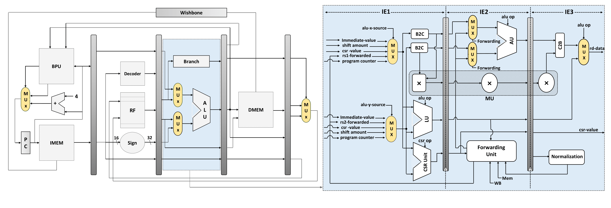

# The NOVACore

The NOVACore is a straightforward 7-stage in-order RISC-V processor implemented in VHDL for FPGA use. It supports the 32-bit RV32IZmmul-Zicsr ISA, providing a RISC-V processor with a base set of integer arithmetic instructions (RV32I), a multiplication extension excluding division (Zmmul), and control and status register manipulation instructions (Zicsr) as per Specification version 2.0. Additionally, it supports significant portions of the machine mode defined in the RISC-V Privileged Architecture Specification v1.10.

The processor has been tested on the Xilinx Zynq-7000 family(XC7Z020-1CLG400C) and Ultra96-V2 which is an Arm-based, AMD Xilinx Zynq UltraScale+ ™ MPSoC development board  using the example SoC design provided in the `example/` directory and the applications found in the `software/` directory. Synthesis and implementation have been tested on various Xilinx's Vivado toolchain versions, most recently version 2023.1.

## Features

* 32-bit RV32IZmmul-Zicsr ISA, providing a RISC-V processor with a base set of integer arithmetic instructions (RV32I), a multiplication extension excluding division (Zmmul), and control and status register manipulation instructions (Zicsr) version 2.0
* Supports large parts of the machine mode defined in the RISC-V Privileged Architecture version 1.10
* Supports up to 8 individually maskable external interrupts (IRQs)
* 7-stage RISC pipeline including 3-step Ternary Encoded Instruction Execution stage(IE: IE1,IE2,IE3)
* 1-bit Dynamic Branch Prediction Unit(D-BPU)
* Optional instruction cache
* Supports the Wishbone bus, version B4

## Peripherals

The project includes a variety of Wishbone-compatible peripherals for use in system-on-chip designs based on the NOVACore.
The main peripherals are:

* Timer - a 32-bit timer with compare interrupt
* GPIO - a configurable-width generic GPIO module
* Memory - a block RAM module
* UART - a UART module with hardware FIFOs, configurable baud rate, and RX/TX interrupts

## Quick Start/Instantiating

Add the source files from the `src/` folder to your project to instantiate the processor. Use the `pp_novacore`
entity to instantiate a processor with a Wishbone interface. Some generics are provided to configure the processor core.

An example System-on-Chip for the Arty development board can be found in the `example/` directory of the source repository.

## Compiler Toolchain

To program the processor, you need an appropriate compiler toolchain. To compile a working toolchain, go to the
[RISCV GNU toolchain repository](https://github.com/riscv/riscv-gnu-toolchain) and clone the project. Compile and install
the toolchain using the following commands (note that `make` will both build and install the toolchain, ensure that the
the destination directory is writeable by your user):

    ./configure --prefix=/opt/riscv-toolchain --with-abi=ilp32 --with-arch=rv32im
    make
 

## Citation  

If you are using **NOVACore** in your scientific or research activities, please cite it properly:  

* F. EbrahimiAzandaryani and D. Fey, “CSD-Driven Speedup in RISC-V Processors,” Design and Architectures for Signal and Image Processing (DASIP)|HiPEAC,2025. 
* F. EbrahimiAzandaryani and D. Fey, “Extern: Boosting RISC-V Core Performance using Ternary Encoding,” Microprocessors and Microsystems, vol. 107, 2024. 

We appreciate your acknowledgment and contributions!

## Reference & License

NOVACore originated from an open-source 5-stage RISC-V processor: (https://opencores.org/projects/potato).